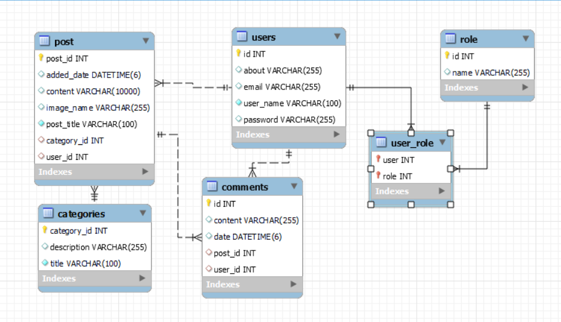

# Blog Application Project
A Basic Blog Application made using spring boot and mysql let's you: <ul>
<li> role based security (admin and normal)</li>
<li> create/delete/update post categories</li>
<li> create/delete/update posts</li>
<li> let's you comment on posts or delete comment from post</li>
<li> register/login to application</li></ul>

## Project Structure

The project follows a layered architecture, which promotes separation of concerns and modularity. The layers include:

- **Controller Layer:** Manages HTTP requests, validates inputs, and directs requests to appropriate services.
- **Service Layer:** Contains the business logic, orchestrates data manipulation, and interacts with DAO repositories.
- **DAO Repositories:** Interface with the database to perform CRUD (Create, Read, Update, Delete) operations on data.

## Database Schema

### User Table
- **user_id:** Primary key, unique identifier for users.
- **username:** User's username.
- **password:** Encrypted user password.
- **about:** User self-description.
- **email:** User's email address.

### Role Table
- **role_id:** Primary key, unique identifier for roles.
- **name:** Role name, e.g., "ROLE_ADMIN", "ROLE_USER".

### User_Role Table (Join Table)
- **user_id:** Foreign key referencing User Table.
- **role_id:** Foreign key referencing Role Table.

### Category Table
- **category_id:** Primary key, unique identifier for categories.
- **name:** Category name.
- **description:** Category description.

### Post Table
- **post_id:** Primary key, unique identifier for posts.
- **title:** Title of the post.
- **content:** Content of the post.
- **added_date:** Timestamp of post creation.
- **category_id:** Foreign key referencing Category Table.
- **user_id:** Foreign key referencing User Table.
- **image_name:** Image address (to be implemented).

### Comment Table
- **id:** Primary key, unique identifier for comments.
- **post_id:** Foreign key referencing Post Table.
- **user_id:** Foreign key referencing User Table.
- **content:** Content of the comment.
- **date:** Timestamp of comment creation.

### ER Diagram

## Getting Started

To run the project locally, follow these steps:

1. Clone the repository: `git clone https://github.com/your-username/BlogApp.git`
2. Configure the database connection settings in `application.properties`.
3. Build and run the project: `mvn spring-boot:run`

Make sure you have Java, Maven, and MySQL installed on your machine.

## Contributing

Contributions are welcome! Feel free to open issues and pull requests to suggest improvements or report bugs.

## License

This project is licensed under the [MIT License](LICENSE).

---

[Utkarsh Vijay](https://github.com/NOOBUV)